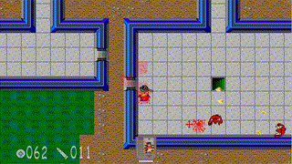

Controls:

Arrows or W,A,S,D - hero movement
Mouse - aim
CTRL or Left Mouse button - shoots
TAB - Mini map
I - invenotry
SPACE or RETURN - opens/closes doors

Modern game console gamepads are supported as well.

Game features:

8 random generated levels. 
Coop multiplayer or deathmatch (UDP protocol).
Watch out for the blue monsters, they can eat items. To recover the item you have to kill the monster.

The game could be built using Cmake (run the cmake_build.sh on linux) or with Visual Studio.
