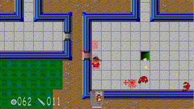

# Codename: Cartridge Quest

## Game features
- Support for Linux, Windows and Android.
- OpenGL/Vulkan renderer.
- 8 randomly generated levels. 
- Network-based multiplayer mode (UDP protocol).
- Collectible game cartridges that act as special abilities for the main character.
- Very annoying music. :-)

## Controls

**Arrows** or **W,A,S,D** - hero movement\
**Mouse** - aim\
**CTRL** or **Left Mouse button** - shoots\
**TAB** - Mini map\
**I** - inventory\
**SPACE** or **RETURN** - opens/closes doors

Modern game console controllers are supported as well.

Watch out for the blue monsters, they can eat items. To recover the item you have to kill the monster.

The configuration file is stored either in .CartridgeQuest dir in your home directory or in c:\Users\UserName\/.CartridgeQuest on Windows

Renderer values: 0 - OpenGL, 1 - Vulkan

## Building from source

The game can be built using CMake (run the cmake_build.sh on Linux) or open the directory with Visual Studio Code.

On window you can build with Visual Studio.

For Android you will need to download Android Studio and NDK.

Project requires these libraries: OpenAL, SDL2, libogg/vorbis, Vulkan SDK(used 1.3.290.0 to build the windows binary)

To build the tests you will need GoogleTest.

